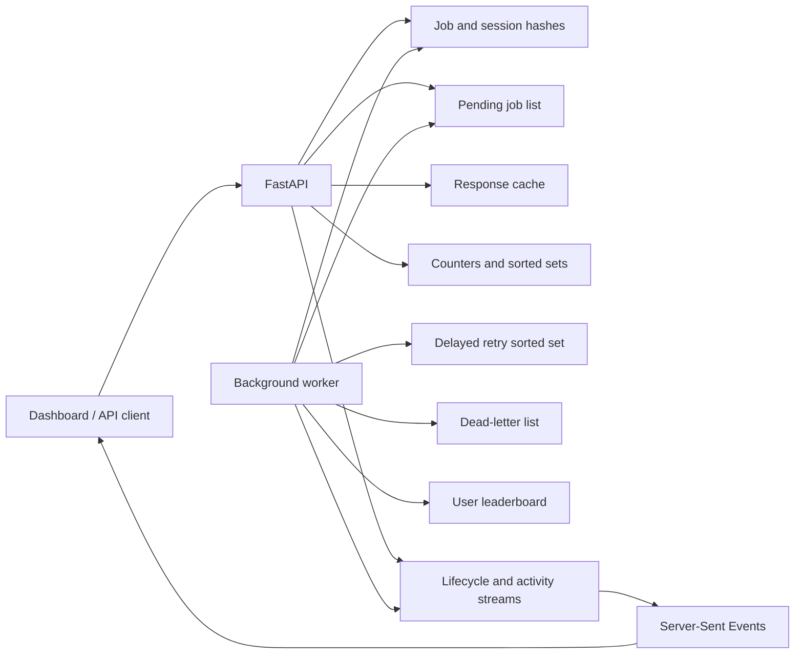
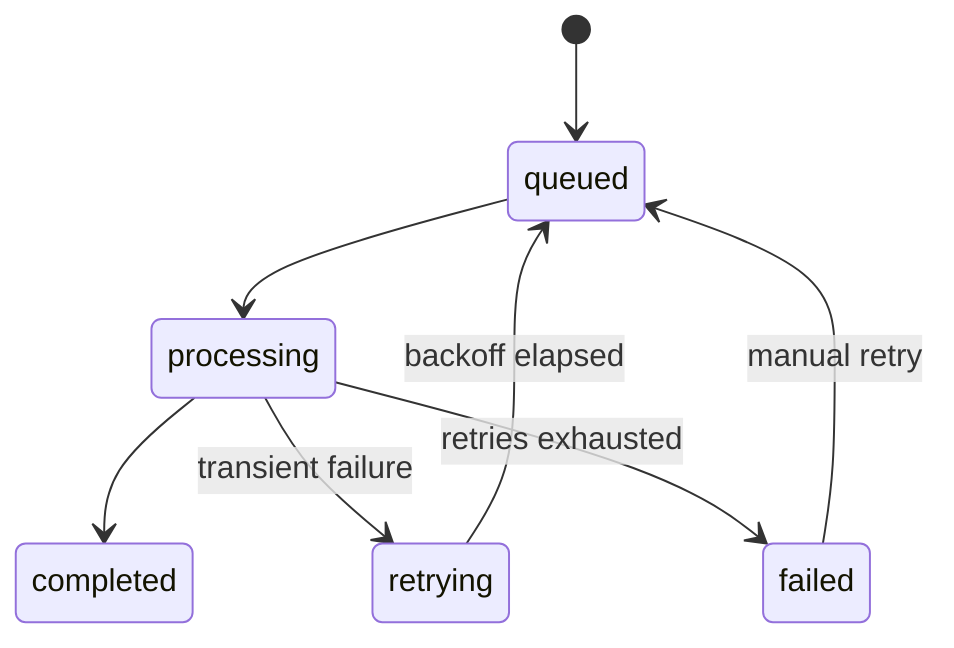

# Architecture

## Boundaries

- Route modules validate HTTP input and translate domain errors.
- Services own business rules and async Redis operations.
- Redis helpers define keys and event serialization.
- The worker owns blocking queue consumption and processor dispatch.
- The dashboard consumes public API contracts only; it has no direct Redis access.

## Job Lifecycle

